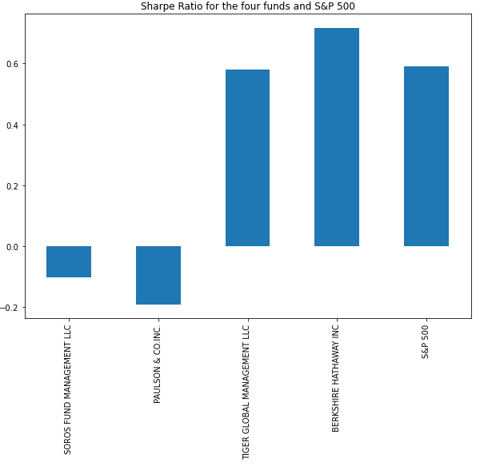

# Risk_Return_Analysis
Analyzing stock portfolios using various metrics

# Analyze the Risk/Return of 4 Funds.

Determine the fund with the most investment potential based on key risk-management metrics: the daily returns, standard deviations, Sharpe ratios, and betas.

## Performance Analysis


Based on the cumulative return data and visualization, we can see that for some brief periods till early 2016, all the 4 funds did outperform S&P 500 Index. But overall, S&P 500 consistently outperforms all the fund portfolios.


## Volatility Analysis


Based on the box plot visualization of the Daily returns for the four fund portfolios, we see that Bershire Hathaway has the greatest spread alongwith some spread out outliers, and hence is the most volatile. On the contrary, Tiger global management fund has the least spread, even if we take into consideration the one negative outlier which is far away from the rest of the data points and hence is the least volatile.


## Risk Analysis

The calculated Standard deviation values and the annualized Standard deviation values for all the funds and the S&P 500 are summarired in the following table: 


----


**Question 1** Based on the annualized standard deviation, which portfolios pose more risk than the S&P 500?

**Answer 1 ** As such there are no funds that pose more risk than S&P 500. Based on the annualised standard deviation, S&P 500 has the highest deviation and hence is the most volatile, posing the most risk.

**Question 2** Based on the rolling metrics, does the risk of each portfolio increase at the same time that the risk of the S&P 500 increases?

**Answer 2** No. There are certain times when it seems that the risk associated with each portfolio increases at the same time as that of S&P 500. But it is not true in the earlier years and it is also not true for every fund at the same time. Some funds may pose an increased risk at some point in time as compared to the other funds. We mostly see all the funds posing an increased risk together in 2020, probably when the pandemic hit.

**Question 3** Based on the rolling standard deviations of only the four fund portfolios, which portfolio poses the most risk? Does this change over time?

**Answer 3** Based on the rolling standard deviations, Bershire Hathaway portfolio poses the most risk out of the four fund portfolios. This was not true till about mis 2016, when other funds where more volatile and hence posed more risk. But since then, Berkshire Hathaway has been consistently showing high rolling standard deviation values.


## Risk - Return Analysis

Following Table shows the Sharpe ratio for the funds and the S&P 500 index


---



Based on our calculations for Sharpe Ratio, we see that for the same amount of risk, Berkshire Hathaway provides the maximum returns as compared to the other funds. It even provides better returns than S&P 500, with a Sharpe ratio of 0.72 as against S&P's Sharpe ratio of 0.59. Paulson offers the worst risk return providing a negative return for the same risk with a sharpe ratio of -0.19. Sharpe ratio indicated excess return adjusted for risk. Higher the sharpe ratio, higher the return adjusted for the same amount of risk. So, Berkshire here offers the highest amount of return for the same amount of risk and Paulson offers the worst amount of return for the same amount of risk.


## Portfolio Diversification

Based on the Analysis so far, we have chosen Berkshire Hathaway and Tiger Global Management Funds to be included in our portfolio. The following table shows the Beta value for the two funds.


The following plots show the 60 day rolling beta values for both the funds. 


**Question 1** Which of the two portfolios seem more sensitive to movements in the S&P 500?

**Answer 1** With a higher rolling beta value, Berkshire Hathaway seems to be more sensitive to movements in the S&P 500

**Question 2** Which of the two portfolios do you recommend for inclusion in your firm’s suite of fund offerings?

**Answer 2** Because of the higher Sharpe ratio and hence the excess return to total risk, Berkshire Hathaway is again the recommended portfolio for inclusion in the firm's suite of fund offerings.

---

## Technologies

This project uses python 3.7 along with the following packages:

* [JupyterLab](https://jupyterlab.readthedocs.io/en/stable/) - Web based user interface for data analysis.

* [pandas](https://github.com/pandas-dev/pandas) - Data analysis and manipulation library.

* [numpy](https://github.com/numpy/numpy) - NumPy is the fundamental package needed for scientific computing with Python.

* [pathlib](https://docs.python.org/3/library/pathlib.html) - This module offers classes representing filesystem paths with semantics appropriate for different operating systems.

* [matplotlib](https://github.com/matplotlib/matplotlib) - Library for creating visualization in Python.

---

## Installation Guide

Please install the following before starting the application

```python
  pip install jupyterlab
  pip install pandas
  pip install numpy
  pip install pathlib
  pip install matplotlib
```

## Usage

To use the return risk analysis, please download and open the **risk_return_analysis.ipynb** in jupyter lab after executing
the following on the command line:

```python
jupyter lab
```
Jupytper Lab should open automatically in a browser. 
If it does not, please follow the instructions on the command line.

---

## Contributors

Abhishika Fatehpuria

Email: abhishika@gmail.com

---

## License

MIT
